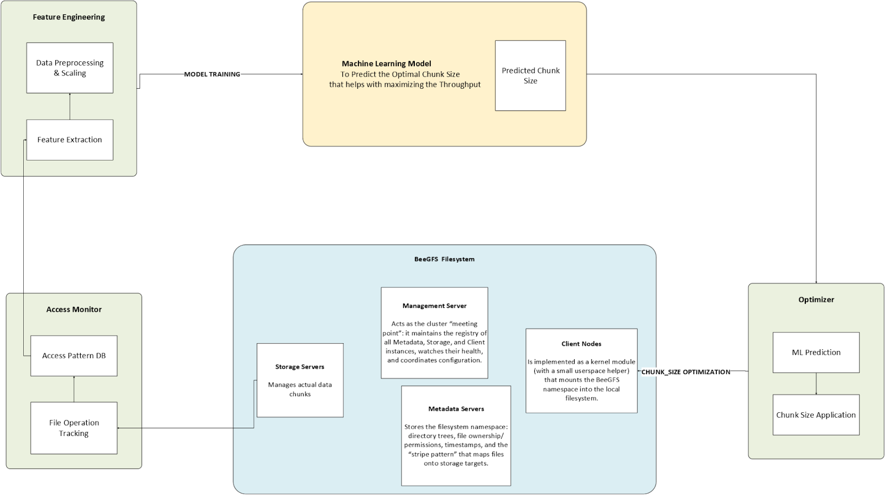

# BeeChunker

A dynamic BeeGFS chunk size optimization system using Self-Organizing Maps.

## Features

- Monitors file access patterns in BeeGFS
- Uses Self-Organizing Maps to learn optimal chunk sizes
- Automatically applies learned configurations to new files
- Provides visualization of access patterns and chunk size distributions

## Installation

```bash
pip install -e .
```

## Architecture


# BeeChunker

BeeChunker is an intelligent system for optimizing chunk sizes in BeeGFS file systems using Self-Organizing Maps (SOM) to learn from file access patterns.

## Features

- **Continuous Monitoring**: Tracks file access patterns across BeeGFS mount points
- **ML-Based Optimization**: Uses Self-Organizing Maps to predict optimal chunk sizes
- **Automatic Rechunking**: Identifies and rechunks suboptimally chunked files
- **New File Optimization**: Sets optimal chunk sizes for newly created files

## Installation

1. Install the package:

```bash
git clone https://github.com/your-username/beechunker.git
cd beechunker
pip install -e .
```

2. Configure BeeGFS mount points in `/opt/beechunker/data/config.json`:

```json
{
  "beegfs": {
    "mount_points": [
      "/mnt/beegfs",
      "/mnt/beegfs2"
    ]
  }
}
```

## Usage

### Component 1: Monitoring Service

The monitoring service tracks file access patterns in your BeeGFS file system.

Start the monitoring service:

```bash
sudo systemctl start beechunker-monitor
```

Or run it manually:

```bash
beechunker-monitor run
```

View monitoring statistics:

```bash
beechunker-monitor stats
```

Clean up old monitoring data:

```bash
beechunker-monitor cleanup --days 30
```

### Component 2: Training the SOM Model

Train the SOM model with your collected access pattern data:

```bash
beechunker train --input-csv /path/to/training_data.csv
```

Or let it load data from the monitoring database:

```bash
beechunker train
```

Set up automatic periodic training:

```bash
# Edit crontab to run training daily at 2:00 AM
crontab -e
# Add the line:
0 2 * * * /usr/bin/beechunker train
```

### Component 3: Optimization Service

The optimizer service applies the trained model to optimize file chunk sizes.

Start the optimization service:

```bash
sudo systemctl start beechunker-optimizer
```

Or run it manually:

```bash
beechunker-optimizer run
```

Optimize a specific file:

```bash
beechunker-optimizer optimize-file /mnt/beegfs/path/to/file.dat
```

### Making Predictions

Predict the optimal chunk size for a file with specific characteristics:

```bash
beechunker predict --file-size 104857600 --read-size 8192 --write-size 4096 --read-count 50 --write-count 10 --extension .csv
```

## Integration with BeeGFS

BeeChunker integrates with BeeGFS through the following mechanisms:

1. **File Access Monitoring**: Uses watchdog or inotify to track file operations
2. **Chunk Size Management**: Uses BeeGFS command-line tools to get and set chunk sizes
3. **Default Pattern Setting**: Sets default chunk patterns for directories based on predicted optimal sizes

## System Components

- **Monitor**: Tracks file access patterns and stores them in a SQLite database
- **SOM Trainer**: Trains a Self-Organizing Map on the collected access patterns
- **Optimizer**: Applies the model to optimize chunk sizes for existing and new files

## Architecture

```
beechunker/
├── cli/                    # Command-line interfaces
│   ├── cli.py              # Main CLI for training and predictions
│   ├── monitor_cli.py      # Monitor service CLI
│   └── optimizer_cli.py    # Optimizer service CLI
├── common/                 # Common utilities
│   ├── beechunker_logging.py  # Logging setup
│   └── config.py           # Configuration management
├── ml/                     # Machine learning components
│   └── som.py              # Self-Organizing Map implementation
├── monitor/                # Monitoring components
│   ├── access_tracker.py   # File access tracking
│   └── db_manager.py       # Database management
└── optimizer/              # Optimization components
    ├── chunk_manager.py    # Chunk size management
    └── file_watcher.py     # New file detection
```

## Configuration Options

Default configuration is stored in `/opt/beechunker/data/config.json`:

```json
{
  "monitor": {
    "db_path": "/opt/beechunker/data/access_patterns.db",
    "log_path": "/opt/beechunker/data/logs/monitor.log",
    "polling_interval": 300
  },
  "optimizer": {
    "log_path": "/opt/beechunker/data/logs/optimizer.log",
    "min_chunk_size": 512,
    "max_chunk_size": 4096,
    "scan_interval": 3600,
    "chunk_diff_threshold": 0.3
  },
  "ml": {
    "models_dir": "/opt/beechunker/data/models",
    "log_path": "/opt/beechunker/data/logs/trainer.log",
    "training_interval": 86400,
    "min_training_samples": 100,
    "som_iterations": 5000
  },
  "beegfs": {
    "mount_points": []
  }
}
```

## Requirements

- Python 3.8+
- BeeGFS installation
- Access to BeeGFS command-line tools
- Root or sudo access (for some operations)